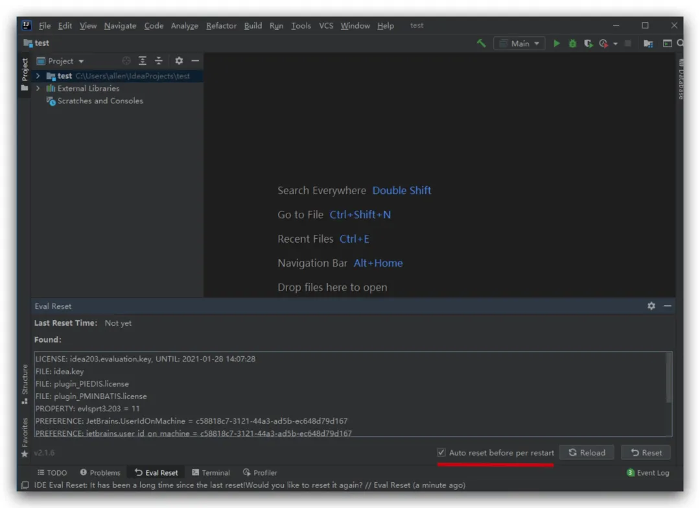

## IntelliJ IDEA 2021.1.3 破解，IDEA 2021.1激活破解，激活持续更新

[Java大神](javascript:void(0);) *昨天*

分享一下 IntelliJ IDEA 2021.1.3 的激活破解教程，永久激活，亲测有效，下面是详细文档哦~

**申明：本教程 IntelliJ IDEA 破解补丁、激活码均收集于网络，请勿商用，仅供个人学习使用，如有侵权，请联系作者删除。若条件允许，希望大家购买正版 ！**

**
**

我们可以通过 无限重置30天试用期的方式持续使用 IDEA，暴力无解，简单又稳定，再也不用担心经常失效的问题了，具体步骤跟着下文步骤一步一步来就行。


## 注意

- **本教程适用于 IntelliJ IDEA 2021.1.2 以下所有版本，请放心食用~**

- **本教程适用于 JetBrains 全系列产品，包括 Pycharm、IDEA、WebStorm、Phpstorm、Datagrip、RubyMine、CLion、AppCode 等。**

- **本教程适用 Windows/Mac/Linux 系统，文中以 Windows 系统为例做讲解，其他系统按照教程顺序即可。**

  **
  **


**PS: 切记不要无休止的一直试用，因为这并不是这个插件的本意！**

## 第一步: 下载最新的 IDEA 2021.1.2 版本安装包

我们先从 IDEA 官网下载 IDEA 2021.1.2 版本的安装包，下载链接如下：

https://www.jetbrains.com/idea/download/


点击下载，静心等待其下载完毕即可。

## 第二步: 先卸载老版本的 IDEA

> 注意，如果电脑上之前有安装老版本的 IDEA, 需要先卸载干净，否则可能安装失败！
>
> 注意，一定要先卸载干净掉老版本的 IDEA。

1.笔者之前安装了老版本的 IDEA, 所以要先卸载，未安装老版本 IDEA 的小伙伴直接跳过，看后面步骤就行:


卸载成功后，点击关闭:


卸载成功后，双击刚刚下载好的 `idea` exe 格式安装包, 打开它；

## 第三步: 开始安装 IDEA 2021.1.2 版本

2.安装目录默认为 `C:\Program Files\JetBrains\IntelliJ IDEA 2021.1.2`, 这里笔者选择的是默认路径:


3.勾选自己想要创建的桌面快捷方式，笔者的操作系统是 64 位的，所以勾选的 64 位快捷方式：


4.点击 `Install` ：


5.安装完成后，勾选 `Run IntelliJ IDEA`，点击 `Finish` 运行软件:


## 第四步：开始激活

6.等待 IDEA 2021.1.2 运行, 中间会先弹出一个注册框，我们勾选 `Evaluate for free`, 点击 `Evaluate`， 先试用30天:


**注意，如果没有弹出上面的界面，可执行重置30天试用期脚本，脚本网盘地址下面可获取**


打开该文件夹后，有对应系统的执行脚本，执行即可：

```
windows系统：reset_jetbrains_eval_windows.vbslinux/mac系统：reset_jetbrains_eval_mac_linux.sh
```

7.进入 IDEA 中， 先随便新建个 Java 工程， 然后将网盘中最新的 IDEA 无限重置 30 天试用期补丁 `ide-eval-resetter-2.1.6.zip`拖入 IDEA 界面中，如下图所示：

> 

> **注意：**
>
> **zip 补丁包无需解压 ~ 无需解压 ~ 无需解压 ~ **
>
> **激活后补丁不要移动，不要删除~**

### 另外一种安装补丁的方式

**如果无法拖动安装，你可以在`Settings/Preferences...` -> `Plugins` 里手动安装插件（`Install Plugin From Disk...`），参考下图:**

> 
>
> 注意：MacOS 系统可能会自动解压，然后把`zip`包丢进回收站, 需要注意一下~

> PS: 破解补丁页面提取人数过多，导致分享的百度网盘链接容易被封：蛋疼ing，为限制人数，目前暂不提供页面直接提取，**改为从笔者公众号提取**。

> **需要的小伙伴，扫描下方公众号二维码，或者关注公众号： Java仓库，回复关键字：`idea`, 即可免费无套路获取激活码、破解补丁，持续更新中~。**


插件安装成功后，会提示如下：


## 第六步: 重启IDEA ！重启IDEA！

安装成功后，重启 IDEA. 可以通过点击 `Help` 菜单，若列表中出现 `Eval Reset`选项，则代表安装成功，可以参考下面的图示。

## 第七步: 安装成功，如何使用？

- 一般来说，在IDE窗口切出去或切回来时（窗口失去/得到焦点）会触发事件，检测是否长达`25`天都没有重置30天试用期，到时候会给出通知让你选择。（初次安装因为无法获取上次重置时间，会直接给予提示）

- 也可以手动唤出插件的主界面：

  

  

- - 如果IDE没有打开项目，在`Welcome`界面点击菜单：`Get Help` -> `Eval Reset`
  - 如果IDE打开了项目，点击菜单：`Help` -> `Eval Reset`

- 唤出的插件主界面中包含了一些显示信息，`2`个按钮，`1`个勾选项：

- - 按钮：`Reload` 用来刷新界面上的显示信息，其中包括上一次重置30天试用期的时间。

  - 按钮：`Reset` 点击会询问是否重置试用30天并**重启IDE**。选择`Yes`则执行重置操作并**重启IDE生效**，选择`No`则什么也不做。（**此为手动重置方式**）

    > **有强迫症的小伙伴，若觉得自动重置不安心，可以通过这种方式来主动重置30天试用期，重置成功后，点击菜单 Help -> Register 可查看最新的剩余试用时间。**

    

  - 勾选项：`Auto reset before per restart` 如果勾选了，则自勾选后**每次重启/退出IDE时会自动重置试用信息**，你无需做额外的事情。（**此为自动重置方式**）

    > **PS: 注意：自动重置是当你重启 IDEA 的时候触发。**
    >
    > **PS: 注意：自动重置是当你重启 IDEA 的时候触发。**
    >
    > **PS: 注意：自动重置是当你重启 IDEA 的时候触发。**


## 第八步: 如何查看剩余的试用期

进入 IDEA 界面后，点击 `Help` -> `Register` 查看：


可以看到，试用期还剩余30天：


无限重置大法好呀，这样我们就相当于永久激活了 IDEA 了，比较重要的点是，这种方法非常稳定，不会动不动就失效。

## 四、一些说明

- 重置30天试用期需要**重启IDE生效**！
- 本插件默认不会显示其主界面，如果你需要，参考本文：`如何使用`小节。
- 市场付费插件的试用信息也会**一并重置**。
- 如果长达`25`天不曾有任何重置动作，IDE会有**通知询问**你是否进行重置。
- 如果勾选：`Auto reset before per restart` ，重置是静默无感知的。
- 简单来说：勾选了`Auto reset before per restart`则无需再管，一劳永逸。

## 补充: 千万不要升级 IDEA（非常重要）

> 注意：若官网更新了 IDEA 新版本, 后面再次打开 IDEA 时，会在右下角弹框提示你更新升级.
>
> ```
> 尽量不要升级 !!! 因为可能导致 IDEA 需要重新激活，且可能发生新版本激活不成功的情况 ！！！
> 尽量不要升级 !!! 因为可能导致 IDEA 需要重新激活，且可能发生新版本激活不成功的情况 ！！！
> ```